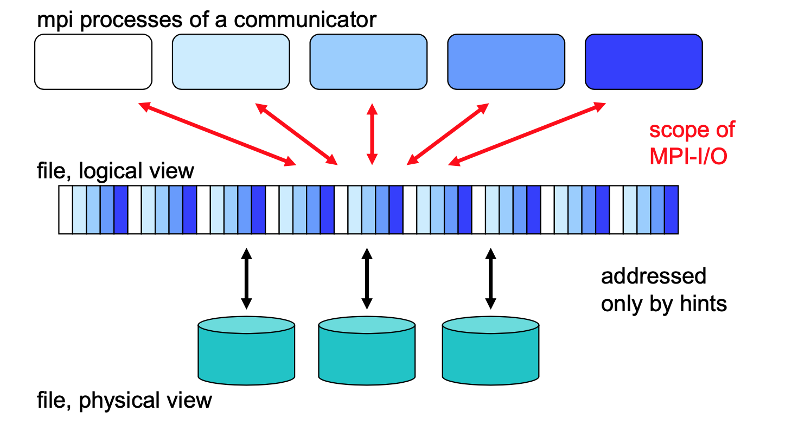
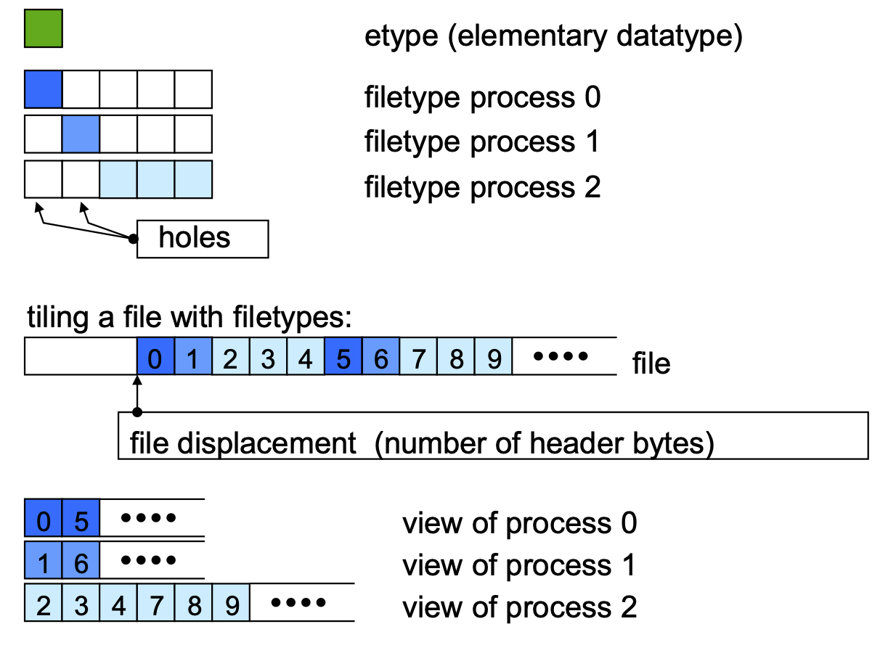
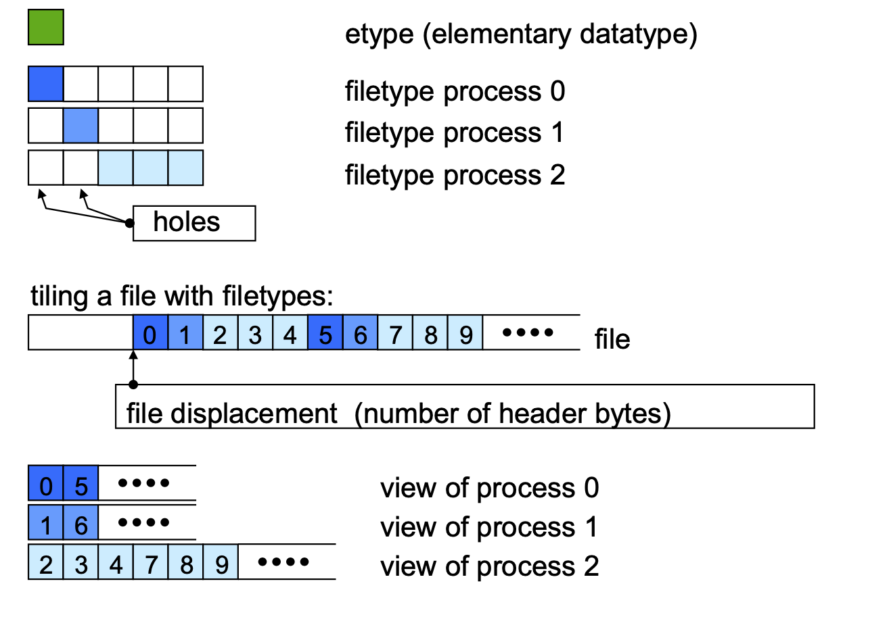
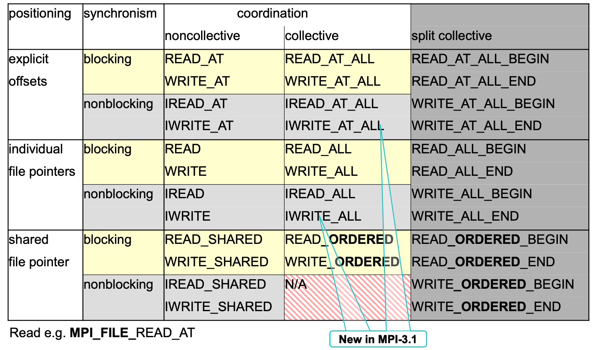
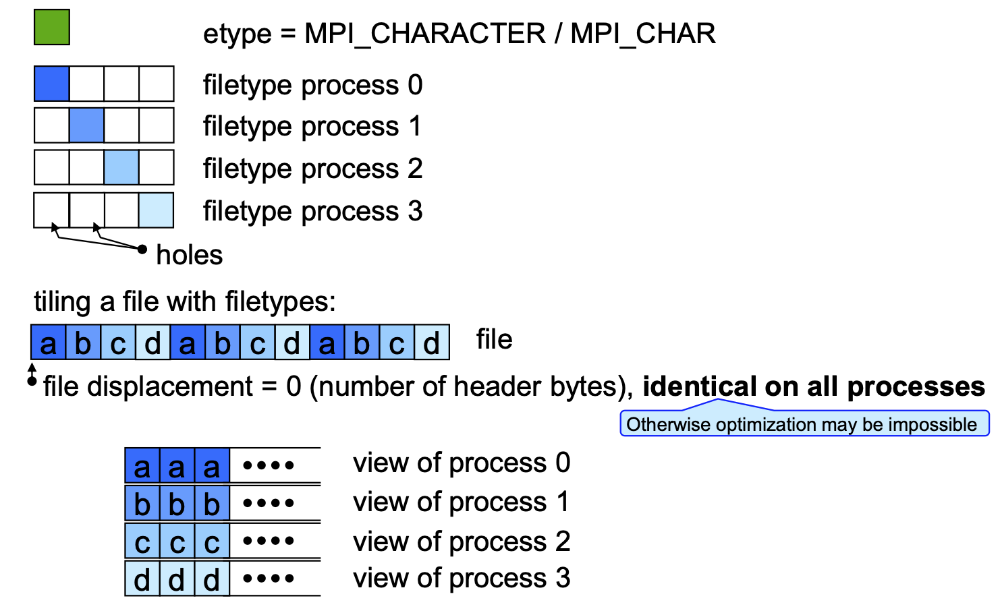

# Parallel File I/O

## Links

* [Parallel HDF5](https://portal.hdfgroup.org/display/HDF5/Introduction+to+Parallel+HDF5)
* [Parallel NetCFD](https://en.wikipedia.org/wiki/NetCDF#Parallel-NetCDF)

## Why

* Many parallel applications need
	* coordinated parallel access to a file by a group of processes
	* simultaneous access
	* all processes may read/write many (small) non-contiguous pieces of the file,
	i.e. the data may be distributed amongst the processes according to a partitioning scheme
	*  all processes may read the same data
* Efficient collective I/O based on
	* fast physical I/O by several processors, e.g. striped
	* distributing (small) pieces by fast message passing

## Requirements

Handling parallel I/O needs:

* handling groups of processes: MPI topologies and groups
* collective operations: file handle defined like communicators
* nonblocking operations to overlap computation & I/O: `MPI_I...` and `MPI_wait()`, ... & new split collective interface
* non-contiguous access: MPI derived datatypes

**Principles**:

* MPI file contains elements of a single MPI datatype (etype)
* partitioning the file among processes with an access template (filetype)
* all file accesses transfer to/from a contiguous or non-contiguous user buffer (MPI datatype)
* nonblocking / blocking and collective / individual read / write routines
* individual and shared file pointers, explicit offsets
* binary I/O
* automatic data conversion in heterog. systems
* file interoperability with external representation

## Features

* Provides a high-level interface to support
	* data file partitioning among processes
	* transfer global data between memory and files (collective I/O)
	* asynchronous transfers
	* strided access
* MPI derived datatypes used to specify common data access patterns for maximum flexibility and expressiveness

## Definitions

* **file** - an ordered collection of typed data items
* **etypes** 
	* is the unit of data access and positioning/offsets
	* can be any basic or dericed datatype
* **filetypes**
	* basic for partitioning a file among processes
	* defines a template for accessing the file
	* different at each process
	* the etype or derived from etype
* **view**
	* each process has its own view
	* the filetype is repeated, starting at displacement
* **offset** - position relative to current view, in units of etype

## How-to

### Opening an MPI file

* `MPI_File_open()`
	* filename must reference the same file on all processes
	* returns a file handle

#### Access modes

* `MPI_MODE_RDONLY` - read only
* `MPI_MODE_RDWR` - reading and writing
* `MPI_MODE_WRONLY` - write only
* `MPI_MODE_CREATE` - create if file doesn’t exist
* `MPI_MODE_EXCL` - error creating a file that exists
* `MPI_MODE_DELETE_ON_CLOSE` - delete on close
* `MPI_MODE_UNIQUE_OPEN` - file not opened concurrently
* `MPI_MODE_SEQUENTIAL` - file only accessed sequentially: mandatory for sequential stream files (pipes, tapes, ...)
* `MPI_MODE_APPEND` - all file pointers set to end of file 	   
### File info

* `MPI_File_open`
* `MPI_File_set_view`
* `MPI_File_set_info`

### Closing and deleting a file

* `MPI_File_close()`
* `MPI_File_delete()` - deleting a file that is not currently opened

### Writing

* `MPI_File_write_at()`
	* writes count elements of datatype from memory buf to the file
	* starting with a offset in units of etype

### Reading

	

## File Views

* Provides a visible and accessible set of data from an open file
* A separate view of the file is seen by each process through triple := (displacement, etype, filetype)
* User can change a view during the execution of the program - but collective operation

### Set view

* `MPI_File_set_view()`
	* changes the process's view of the data 

### Get view

* `MPI_File_get_view()`
	* returns the process's view of the data  

## Individual File pointers

* giving the opportunity for implicit offsets

## Shared Filepointer

* `MPI_File_read_shared()`
* `MPI_File_read_ordered()`
* `MPI_File_seek_shared()`
* `MPI_File_get_position_shared()`
* `MPI_File_get_byte_offset()`

## Other file manipulation routines

* `MPI_File_preallocate()` - pre-allocating space for a file
* `MPI_File_set_size()` - resizing a file
* `MPI_File_get_size()` - query file size
* Querying file parameters
	* `MPI_File_get_group()`
	* `MPI_File_get_amode()`
* File info object
	* `MPI_File_set_info()`
	* `MPI_File_get_info()`  