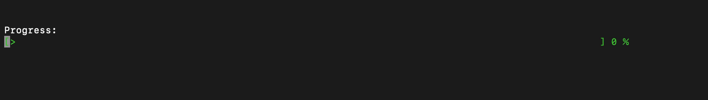

# CppUtils

**Utilities (e.g. Parser, Logger, ...) for C++**

## Prerequisites
> You need to install the [boost](https://www.boost.org/doc/libs/1_75_0/more/getting_started/unix-variants.html) library on your system.

## Simple example program
Build with `make` and run `bin/cpp-utils` to get help on usage:
```
[INFO ] Running some utility code snippets in C++
Usage:
  cpp-utils [OPTION...]

  -T, --timer          Timing is key
  -P, --progress-bar   Make some progress
  -C, --config-parser  Parse the config file real hard
  -h, --help           Show this help
```
The [code](main.cpp) serves as reference for the usage of all the utils in this repository.

## Content

### [ConfigParser](ConfigParser/)

Configuration file parser built on `boost::property_tree::ptree`. 

> Supports `.json`, `.info`, `.ini` and `.xml`.

#### Usage

*Example configuration file:* [example-json](ConfigParser/resources/config.json)

```cpp
    #include "ConfigParser.h"

    // parse the configuration file
    ConfigParser confP {ConfigParser("ConfigParser/resources/config.json")};
    
    // get simple value by key
    int version { confP.getVal<int>("info.version");
    
    // get object holding multiple keys
    auto cp_mode = confP.getObj("modes.config-parser");
    // get value in obj by key
    std::string optFlag = cp_mode.getVal<std::string>("opt");
    
    // accessing list of objects
    for(auto module: confP.getObjList("utils")){
        // access field
        std::cout << module.get<std::string>("description") << std::endl;
    }
```

### [Logger](Logger/)

Class for logging in dependece of `typelog`:

* `DEBUG`
* `INFO`
* `WARN`
* `ERROR`

with coloring of printouts.

#### Usage

```cpp
structlog LOGCFG = {};

LOGCFG.headers = true;
LOGCFG.level = DEBUG;

Logger(DEBUG) << "Debug message";
Logger(INFO)  << "Info message";
Logger(WARN)  << "Warning message";
Logger(ERROR) << "Error message";

// printing variables
int a = 0;
Logger(INFO) << "a = " << a;
```

### [Timer](Timer/)

Class for timing events.

#### Dependencies

* `<chrono>`

#### Usage

```cpp
Timer timer;
timer.reset();
// do something
double elapsedTime = timer.elapsed();
std::cout << "Elapsed time: " << elapsedTime << " s" << std::endl;
```

### [ProgressBar](ProgressBar/)

Visualize progress using a **progress bar** within the print-outs/shell.



#### Usage

```cpp
// initialize colors (if wanted)
Color::Modifier green(Color::FG_GREEN);
Color::Modifier default(Color::FG_DEFAULT);
    
// initialize progress bar
int width = 80;
ProgressBar progressBar(width);

for (int i = 0; i < 1500; i++) {

	// calculate something
	
	//change color to green
	std::cout << green;
	//calculate progress
	float progress = i/1500.0;
	// visualize progress using the progress bar
	progressBar.show_progress(progress);
	// change color back to default
	std::cout << default;
}
```

## Used libraries
* **cxxopts:** For parsing command line options in GNU style [cxxopts](https://github.com/jarro2783/cxxopts)
  is utilized.


